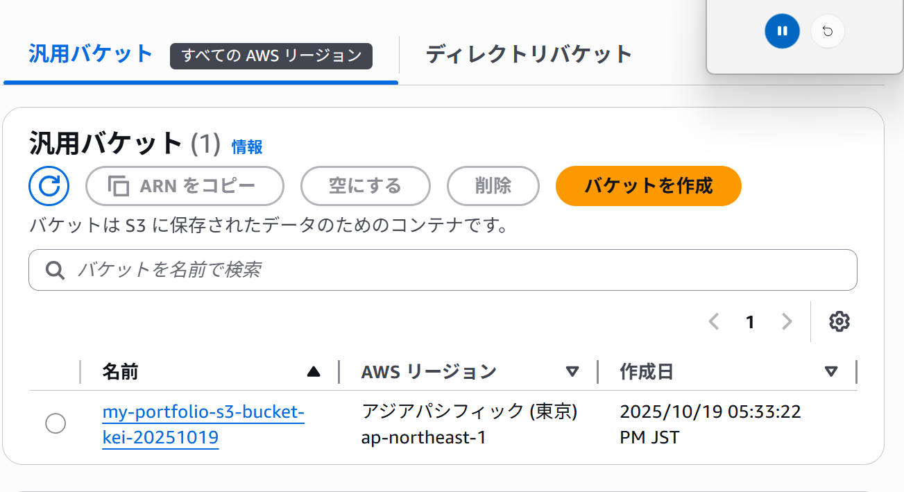
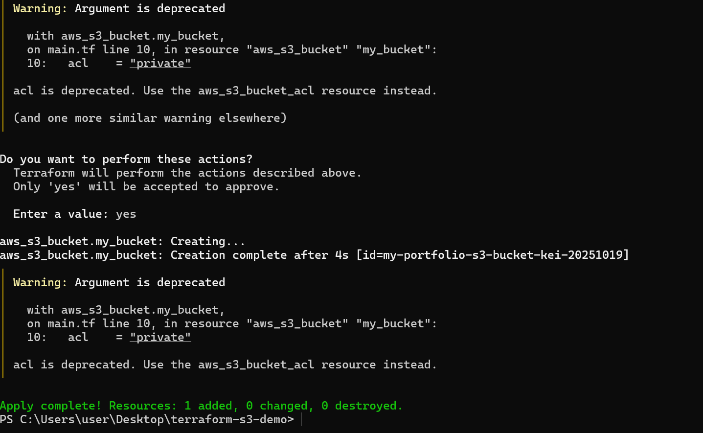

# Terraformで作るAWS S3バケットポートフォリオ

## 概要
このプロジェクトは、Terraformを使用してAWS上にS3バケットを自動作成するデモです。  
PowerShellでTerraformを実行し、AWS CLIで認証情報を設定して作成しました。

## 技術スタック
- AWS CLI
- Terraform
- PowerShell

## 実行結果スクショ

### AWSコンソール

*作成されたS3バケットが表示されていることを確認*

### PowerShellでのTerraform実行結果

.png)
*terraform apply → S3作成、terraform destroy → 削除が確認できる*

## デモ手順
1. AWS CLIで認証情報を設定
```bash
aws configure

- `bucket` 名前はグローバルで一意にする必要あり
- `acl = "private"` でバケットを非公開に設定

## 学んだこと
Infrastructure as Code(IaC)の基本概念
Terraformの初期化、適用、削除の流れ
AWS CLIによる認証設定
S3バケットの作成・確認・削除操作
GitHubでポートフォリオとして管理する方法
